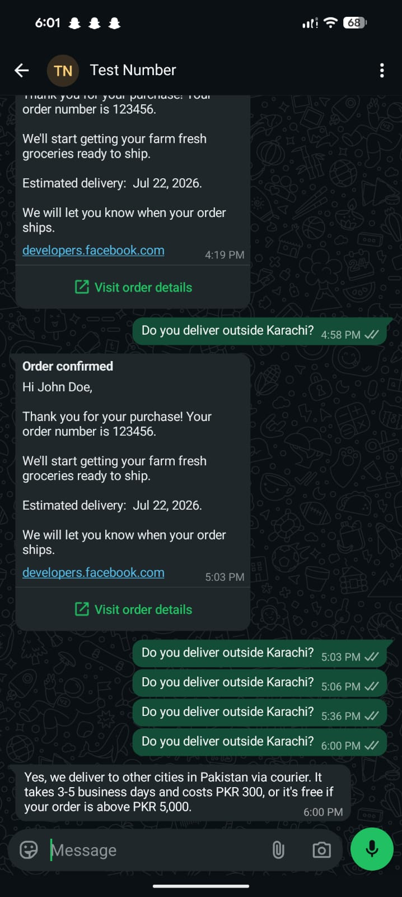
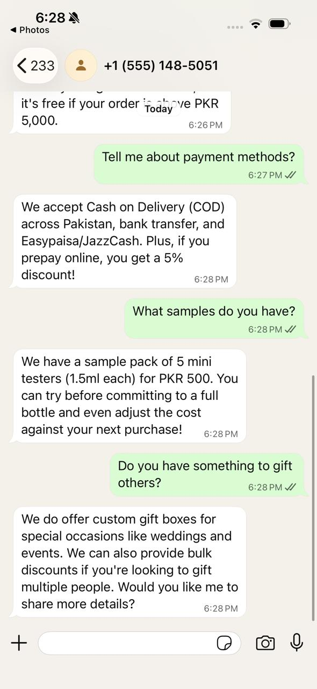
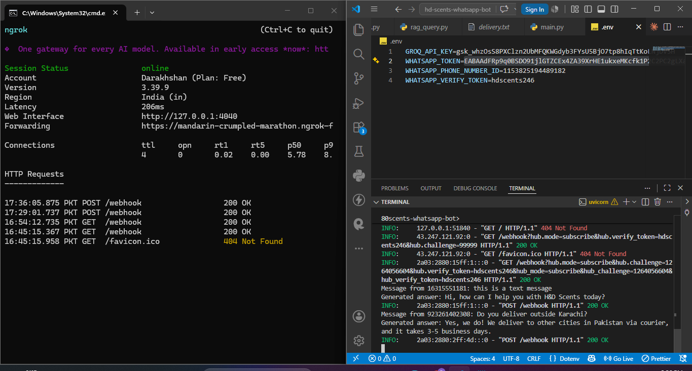
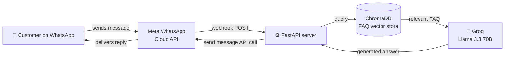

# 🌸 H&D Scents  WhatsApp AI FAQ Assistant

<p align="center">
  <em>An AI-powered WhatsApp customer support bot for a perfume business,<br/>
  built with a RAG pipeline and Meta's WhatsApp Cloud API.</em>
</p>

<p align="center">
  
  
  
  
  
</p>

---

## 📌 Overview

Customers message the business's WhatsApp number directly and get **instant, accurate answers** to common questions — hours, pricing, delivery, returns, samples, and more  without waiting for a human agent.

This project demonstrates end-to-end integration of a **Retrieval-Augmented Generation (RAG) chatbot with a real messaging channel**, a common requirement for SMB customer-support automation work in the South Asian freelance market.

> Built as a portfolio piece to demonstrate WhatsApp Business API integration — a client-ready pattern that can be adapted to any small business's FAQ data in minutes.

---

## 💬 Demo

**A real conversation on WhatsApp:**



**Multiple questions handled in one conversation:**



**Backend confirmation — full pipeline working end-to-end:**



---

## 🏗️ Architecture



**How it works:**
1. A customer sends a WhatsApp message to the business number.
2. Meta forwards it to our FastAPI webhook.
3. The message is embedded and matched against a ChromaDB vector store of the business's FAQs.
4. The retrieved FAQ context is passed to **Groq's Llama 3.3 70B**, which generates a natural-language reply grounded strictly in that context (no hallucination).
5. The reply is sent back to the customer via the WhatsApp Cloud API.

---

## 🛠️ Tech stack

| Layer | Technology |
|---|---|
| Messaging channel | WhatsApp Cloud API (Meta) |
| Webhook server | FastAPI + Uvicorn |
| Vector database | ChromaDB |
| LLM | Groq — Llama 3.3 70B |
| Local tunneling (dev) | ngrok |

---

## 📂 Project structure

```
hd-scents-whatsapp-bot/
├── data/                  # FAQ knowledge base (.txt files)
├── screenshots/           # Demo screenshots
├── chroma_db/             # Persisted vector store (auto-generated, gitignored)
├── load_faqs.py           # One-time script to load FAQs into ChromaDB
├── rag_query.py           # RAG logic: retrieve + generate answer
├── whatsapp_sender.py     # Sends replies via WhatsApp Cloud API
├── main.py                # FastAPI webhook (receives + responds to messages)
├── requirements.txt
├── .env.example           # Template for required environment variables
└── README.md
```

---

## 🚀 Setup instructions

### 1. Clone and install dependencies

```bash
git clone https://github.com/DarakhshanMujtaba/hd-scents-whatsapp-bot.git
cd hd-scents-whatsapp-bot
pip install -r requirements.txt
```

### 2. Configure environment variables

Copy `.env.example` to `.env` and fill in your own credentials:

```env
GROQ_API_KEY=your_groq_api_key
WHATSAPP_TOKEN=your_whatsapp_access_token
WHATSAPP_PHONE_NUMBER_ID=your_phone_number_id
WHATSAPP_VERIFY_TOKEN=any_random_string_you_choose
```

- **Groq API key:** free at [console.groq.com](https://console.groq.com)
- **WhatsApp credentials:** via [Meta for Developers](https://developers.facebook.com) → create an app → add the WhatsApp product → use the free test number under **"Try it out"**

### 3. Load the FAQ knowledge base into ChromaDB

```bash
python load_faqs.py
```

> To reuse this for a different business, just replace the files in `data/` with your own FAQ `.txt` files and re-run this script.

### 4. Run the webhook server

```bash
uvicorn main:app --reload --port 8080
```

### 5. Expose the server publicly (for local development)

```bash
ngrok http 8080
```

Copy the `https://...ngrok-free.app` URL that ngrok gives you.

### 6. Configure the webhook in Meta for Developers

Under your app's WhatsApp settings → **Configure Webhooks**:

| Field | Value |
|---|---|
| Callback URL | `https://<your-ngrok-url>/webhook` |
| Verify token | same value as `WHATSAPP_VERIFY_TOKEN` |

Then subscribe to the **`messages`** webhook field, and run this once to subscribe your app to the WhatsApp Business Account's events:

```bash
curl -X POST "https://graph.facebook.com/v25.0/<YOUR_WABA_ID>/subscribed_apps" \
  -H "Authorization: Bearer <YOUR_ACCESS_TOKEN>"
```

### 7. Test it 🎉

Message your WhatsApp test number from a phone number registered as a recipient in the Meta dashboard. You should get an AI-generated reply within seconds.

---

## ⚠️ Known limitations (test/demo mode)

This project runs on Meta's **free test number**, intended for development and demos — not production. Before handing this off to a real client, the following would need addressing:

- **Recipient allowlist** — test numbers can only message up to 5 pre-approved phone numbers. Production requires a verified WhatsApp Business Account and a real business number.
- **24-hour messaging window** — WhatsApp only allows free-form replies within 24 hours of the customer's last message. Outside that, Meta-approved message templates are required.
- **ngrok tunnel** — the local webhook URL is temporary and changes on restart. Production needs a permanent host (e.g. Render, Railway, a VPS).
- **Access token** — the development token expires every 24 hours. Production requires a permanent System User token.

---

## 🔭 Possible next steps

- [ ] Persist conversation history per customer for multi-turn context
- [ ] Add a fallback response for out-of-scope questions with human handoff
- [ ] Log conversations for review and continuous FAQ improvement
- [ ] Deploy to a persistent host instead of relying on ngrok

---

## 👩‍💻 Author

**Darakhshan Mujtaba**
Built as part of an AI/ML automation portfolio, demonstrating RAG chatbot integration with the WhatsApp Cloud API for SMB customer-support use cases.
